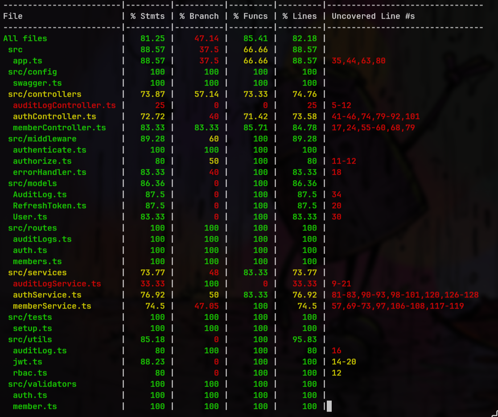
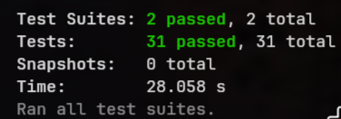

# RBAC Application

A full-stack Role-Based Access Control (RBAC) application with JWT authentication, member management, audit logging, and Swagger API documentation.

## Screenshots

| Login Page | Dashboard |
|---|---|
|  |  |

---

## Architecture

```
┌─────────────────────────────────────────────────────────────────┐
│                        CLIENT BROWSER                           │
│                    http://localhost:3000                         │
└──────────────────────────┬──────────────────────────────────────┘
                           │ HTTP / Axios
                           ▼
┌─────────────────────────────────────────────────────────────────┐
│              FRONTEND  (Next.js 16 + TypeScript)                │
│                                                                 │
│  Pages: /login  /register  /dashboard  /members  /audit-logs   │
│  State: React Context (AuthProvider, ThemeProvider)             │
│  HTTP:  services/api.ts  (Axios + auto token refresh)          │
└──────────────────────────┬──────────────────────────────────────┘
                           │ REST API  (Bearer token + httpOnly cookie)
                           ▼
┌─────────────────────────────────────────────────────────────────┐
│              BACKEND  (Express.js + TypeScript)                 │
│                    http://localhost:5000                         │
│                                                                 │
│  Routes:   /api/auth/*   /api/members/*   /api/audit-logs       │
│  Swagger:  /api/docs                                            │
│  Auth:     JWT access (15 min) + refresh token (7 days)        │
│  RBAC:     authenticate() → authorize(permission)               │
└──────────────────────────┬──────────────────────────────────────┘
                           │ Mongoose ODM
                           ▼
┌─────────────────────────────────────────────────────────────────┐
│                   MongoDB Atlas (cloud)                         │
│   Collections:  users   refreshtokens   auditlogs               │
└─────────────────────────────────────────────────────────────────┘
```

## Features

- JWT authentication with access token (15 min) + refresh token (7 days) rotation
- Role-based access control — Admin, Manager, Member
- Member CRUD with pagination, search, and sorting
- Audit logging for all state-changing actions (admin-only view)
- Dark mode with system preference detection
- Swagger UI API documentation
- 31 Jest + Supertest unit and integration tests
- Fully typed TypeScript on both frontend and backend

## RBAC Permission Matrix

| Action         | Admin | Manager | Member |
|----------------|-------|---------|--------|
| View Members   | ✓     | ✓       | ✓      |
| Create Member  | ✓     | ✓       | ✗      |
| Edit Member    | ✓     | ✓       | ✗      |
| Delete Member  | ✓     | ✗       | ✗      |
| View Audit Logs| ✓     | ✗       | ✗      |

## Project Structure

```
Raghavan-RBAC-Project/
├── app/                          # Next.js App Router pages
│   ├── (auth)/                   # Login & Register pages
│   ├── (dashboard)/              # Protected pages
│   │   ├── dashboard/
│   │   ├── members/
│   │   ├── audit-logs/
│   │   └── profile/
│   ├── layout.tsx                # Root layout
│   └── globals.css               # Global styles + CSS variables
├── components/                   # Shared React components
│   ├── AuthProvider.tsx          # Auth context
│   ├── ThemeProvider.tsx         # Dark mode context
│   ├── Layout.tsx                # Nav + shell
│   └── ProtectedRoute.tsx        # Auth guard
├── services/
│   └── api.ts                    # Axios instance + all API calls
├── proxy.ts                      # Next.js edge proxy (auth redirect)
├── .env.local                    # Frontend env vars
│
└── backend/
    ├── src/
    │   ├── config/               # DB connection, Swagger spec
    │   ├── controllers/          # Route handler functions
    │   ├── middleware/           # authenticate, authorize, errorHandler
    │   ├── models/               # Mongoose schemas
    │   ├── routes/               # Express routers with JSDoc
    │   ├── services/             # Business logic
    │   ├── tests/                # Jest + Supertest tests
    │   ├── utils/                # JWT helpers, RBAC, audit log
    │   ├── validators/           # Zod schemas
    │   ├── app.ts                # Express app (no DB call)
    │   └── server.ts             # Entry point (connects DB, starts server)
    ├── .env                      # Backend env vars
    ├── package.json
    └── tsconfig.json
```

## Tech Stack

| Layer     | Technology                                      |
|-----------|-------------------------------------------------|
| Frontend  | Next.js 16, TypeScript, Tailwind CSS v4, Axios  |
| Backend   | Express.js, TypeScript, Zod validation          |
| Database  | MongoDB Atlas, Mongoose                         |
| Auth      | JWT (jsonwebtoken), bcryptjs                    |
| Docs      | Swagger (swagger-jsdoc + swagger-ui-express)    |
| Testing   | Jest, Supertest, mongodb-memory-server          |

## Setup Instructions

See [docs/setup-guide.md](docs/setup-guide.md) for full setup instructions.

### Quick Start

```bash
# 1. Clone the repository
git clone <repo-url>
cd Raghavan-RBAC-Project

# 2. Start the backend
cd backend
cp .env.example .env        # then fill in your values
npm install
npm run dev                 # http://localhost:5000

# 3. Start the frontend (new terminal)
cd ..
cp .env.sample .env.local   # already configured for local dev
npm install
npm run dev                 # http://localhost:3000
```

## Running Tests

```bash
cd backend
npm test                    # run all tests
npm run test:coverage       # with coverage report
```

## API Documentation

Swagger UI is available at `http://localhost:5000/api/docs` when the backend is running.

See [docs/api-docs.md](docs/api-docs.md) for full endpoint reference.

## Environment Variables

See [docs/setup-guide.md](docs/setup-guide.md) for all environment variables.

- Frontend: `.env.local` — only needs `NEXT_PUBLIC_API_URL`
- Backend: `backend/.env` — needs MongoDB URI, JWT secrets, allowed origins

## Deployment

### Backend (e.g. Railway, Render, Fly.io)
```bash
cd backend
npm run build        # compiles TypeScript to dist/
npm start            # runs dist/server.js
```

### Frontend (e.g. Vercel)
```bash
npm run build
npm start
```

Set `NEXT_PUBLIC_API_URL` to your deployed backend URL and update `ALLOWED_ORIGINS` in the backend `.env` to include your frontend domain.
